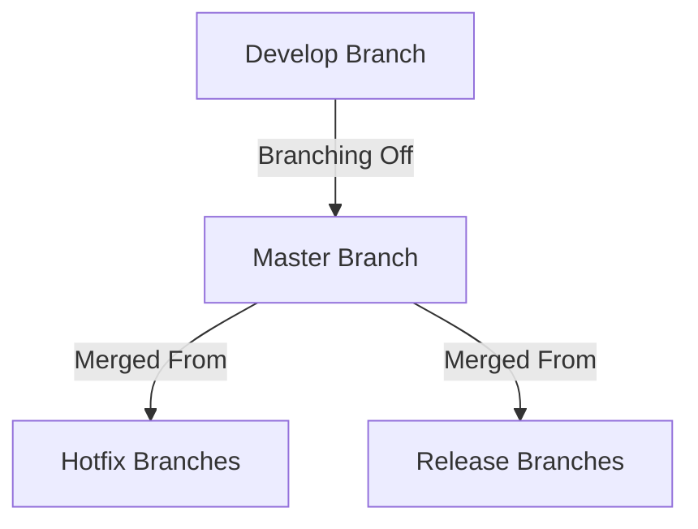

# Design Document Template

## {{project_name}}:

### Revision History:
| Version number | Date Changed   | Brief Description of Changes |
|----------------|----------------|------------------------------|
| 1              | 2023/11/10     | Created Template             |

### Document Approval Details:
| Client Name                                                    | Current Role                                                   | Section Responsible for                      |
|----------------------------------------------------------------|----------------------------------------------------------------|----------------------------------------------|
| {{client_business_metrics_name}}                               | {{client_business_metrics_role}}                               | Business Metrics                             |
| {{client_user_types_and_desired_actions_name}}                 | {{client_user_types_and_desired_actions_role}}                 | User Types & Desired Actions                 |
| {{client_high_level_process_flow_name}}                        | {{client_high_level_process_flow_role}}                        | High-Level Process Flow                      |
| {{client_logical_view_name}}                                   | {{client_logical_view_role}}                                   | Logical View                                 |
| {{client_process_views_name}}                                  | {{client_process_views_role}}                                  | Process Views                                |
| {{client_development_views_name}}                              | {{client_development_views_role}}                              | Development Views                            |
| {{client_physical_views_name}}                                 | {{client_physical_views_role}}                                 | Physical Views                               |
| {{client_scenarios_name}}                                      | {{client_scenarios_role}}                                      | Scenarios                                    |
| {{client_assumptions_and_dependencies_name}}                   | {{client_assumptions_and_dependencies_role}}                   | Assumptions & Dependencies                   |
| {{client_features_and_priorities_name}}                        | {{client_features_and_priorities_role}}                        | Features and Priorities                      |
| {{client_feature_detail_requirements_name}}                    | {{client_feature_detail_requirements_role}}                    | Feature Detail Requirements                  |
| {{client_data_governance_name}}                                | {{client_data_governance_role}}                                | Data Governance                              |
| {{client_schema_definition_and_data_modeling_name}}            | {{client_schema_definition_and_data_modeling_role}}            | Schema Definition & Data Modeling            |
| {{client_data_factory_and_synthetic_data_specifications_name}} | {{client_data_factory_and_synthetic_data_specifications_role}} | Data Factory & Synthetic Data Specifications |
| {{client_ui_data_integration_plans_name}}                      | {{client_ui_data_integration_plans_role}}                      | UI/Data Integration Plans                    |
| {{client_technical_review_and_feedback_process_name}}          | {{client_technical_review_and_feedback_process_role}}          | Technical Review and Feedback Process        |

### Review and Feedback Process:
   - Step-by-step process for reviewing the document
   - Templates or forms for providing structured feedback

### Introduction:
   - Purpose of the document
   - Scope of the project
   - Intended audience and reading instructions

### Business Metrics:
- Using the following sections from the [Client Briefing template](https://github.com/RyanJulyan/rocket/blob/main/01_initiation_phase/01_client_briefing_template.md)
  - Purpose of the Project
   - Key Objectives
   - Vision and End Goals
   - Expected Outcomes
   - Specific Features/Functions
   - Success Criteria
- [ ] Unpack detailed objectives with associated SMART metrics
   - Define the methodology for measurement and tracking

| No #    | Business Metric Name   | Description                 | Business Zone Pain Point                            | Evaluation Timeframe | Calculation                 |
|---------|------------------------|-----------------------------|-----------------------------------------------------|----------------------|-----------------------------|
| ...     | ....                   | ....                        | *Make Money / Save Money / Save Time / Save Effort* | ...                  | ....                        |

#### Comments and Feedback:
- [Space for any comments or feedback from the reviewers and signatories]

### User Types & Desired Actions:
   - Detailed user personas including demographics, behaviors, and needs
   - Specific actions each user type should be able to perform
   - Connection between user actions and business metrics
   
| User Name          | User Description/Identifying Features | Desired Action                    | Associated Business Metric  |
|--------------------|---------------------------------------|-----------------------------------|-----------------------------|
| ....               | ....                                  | ....                              | ....                        |

#### Comments and Feedback:
- [Space for any comments or feedback from the reviewers and signatories]

### High-Level Process Flow:
   - Detailed logical view with diagrams
   - Description of the 4+1 architectural view
   - Narratives for each high-level process

#### Comments and Feedback:
- [Space for any comments or feedback from the reviewers and signatories]

### Summary of 4 + 1 Architectural View Model in Software
The 4+1 Architectural View Model is a framework for describing the architecture of software-intensive systems. It was introduced by Philippe Kruchten in 1995 to address the limitations of traditional software architecture diagrams. The model is designed to present multiple views of a system to cater to different stakeholders like end-users, developers, system engineers, and project managers.

#### The Five Views
1. **Logical View**: Focuses on the system's functionality from the end-user's perspective. Class diagrams and state diagrams are often used to represent this view.
1. **Process View**: Addresses the system's run-time behavior, focusing on dynamic elements like processes and their communication. It deals with aspects like concurrency, distribution, and performance.
1. **Development View**: Looks at the system from a programmer's perspective and is concerned with software management. It uses UML Component diagrams and Package diagrams for representation.
1. **Physical View**: Portrays the system from a system engineer's standpoint, focusing on the topology of software components and their physical connections.
1. **Scenarios**: These are the 'plus one' view and are essentially use cases or sequences of interactions that help in understanding, validating, and demonstrating the architecture.

#### Why Each View is Needed
- **Logical View**: Helps in understanding what the system is supposed to do.
- **Process View**: Important for understanding how the system will operate in a real-world environment.
- **Development View**: Crucial for developers for code organization and management.
- **Physical View**: Important for system engineers for deployment considerations.
- **Scenarios**: Useful for validating that the architecture meets the requirements and for initial testing.

#### Comments and Feedback:
- [Space for any comments or feedback from the reviewers and signatories]

### Assumptions & Dependencies:
   - Comprehensive list of project assumptions
   - Identified dependencies and their impact on the project

#### Comments and Feedback:
- [Space for any comments or feedback from the reviewers and signatories]

### Features and Priorities:
   - Feature list with detailed descriptions

| Feature No # | Feature Name           | Description                 | Calculation                 |
|--------------|------------------------|-----------------------------|-----------------------------|
| ...          | ....                   | ....                        | ....                        |

   - Prioritization Criteria:
      - Put each feature into one of three categories:
         - Achievable
         - Nice to have
         - Not feasible
      - Define each element’s difficulty (Diff) as either:
         - Easy
         - Medium
         - Difficult
      - Given the areas Value (V), Cost (C), and Risk (R).
         - Give each area a score out of 10 for Value (V), Cost (C), and Risk (R).
         - Calculate the Priority (P), in which (P) = Value / (Cost + Risk).
   - Phase-wise breakdown of feature implementation

#### Achievable
> *Critical tasks/Quick win/Easy/Valuable*

| Phase   | Feature No # | Feature | Diff    | Value | Cost  | Risk  | Priority              |
|---------|--------------|---------|---------|-------|-------|-------|-----------------------|
| ....    | ...          | ....    | ....    | ..    | ..    | ..    | Value / (Cost + Risk) |

#### Nice to have
> *If Enough Time/It would be really cool if*

| Phase   | Feature No # | Feature | Diff    | Value | Cost  | Risk  | Priority              |
|---------|--------------|---------|---------|-------|-------|-------|-----------------------|
| ....    | ...          | ....    | ....    | ..    | ..    | ..    | Value / (Cost + Risk) |

#### Not feasible
> *Too Expensive/Not Enough Time/Not Valuable Enough*

| Phase   | Feature No # | Feature | Diff    | Value | Cost  | Risk  | Priority              |
|---------|--------------|---------|---------|-------|-------|-------|-----------------------|
| ....    | ...          | ....    | ....    | ..    | ..    | ..    | Value / (Cost + Risk) |

#### Comments and Feedback:
- [Space for any comments or feedback from the reviewers and signatories]

### Feature Detail Requirements:
> Feature Detail Requirements describe each feature or capability a software program, product, or system should have. These requirements clarify each feature's purpose, behaviour, and interactions.

| Action                    | Details                                                              |
|---------------------------|----------------------------------------------------------------------|
| Feature No#:              | ...                                                                  |
| Feature Name:             | ...                                                                  |
| Process Flow Step:        | ...                                                                  |
| Deadline:                 | ...                                                                  |	
| Feature Difficulty:       | ...                                                                  |
| Feature Priority:         | ...                                                                  |	
| Feature Description:      | ...                                                                  |
| Dependencies:             | ...                                                                  |
| Constraints:	             | ...                                                                  |
| Inputs:	                | ...                                                                  |
| Process/User Steps:       | ...                                                                  |
| Output:                   | ...                                                                  |
| Exposure:                 | ...                                                                  |
| Error Handling:           | ...                                                                  |
| Performance Expectations: | ...                                                                  |
| Acceptance Criteria:      | ...                                                                  |
| Can this be simplified?   | ___ (Yes/No), How if yes:___________________________________________ |
| Need more information?    | ___ (Yes/No), What if yes:__________________________________________ |

### Data Specification Detailing Overview:
- Objective: [Outline the goals for detailing the data specifications at this project stage.]  
- Scope: [Define the scope of data elements, structures, and storage details that will be addressed.]

#### Data Governance:
   - **Data Quality Framework:**
    - [Describe the measures and controls in place to ensure data quality throughout the project.]
   - **Compliance Requirements:**
    - [Detail any regulatory compliance requirements and how they will be met.]
   - **Policies and Standards:**
     - Comprehensive documentation of data governance policies, including security, privacy, and compliance.
   - **Data Stewardship:**
     - Roles and responsibilities for data management and quality control.

#### Schema Definition & Data Modeling:
   - **Entity-Relationship Diagrams:**
      - [Provide detailed ER diagrams with a legend explaining symbols and conventions used.]
   - **Normalization and Data Integrity Rules:**
      - [Describe the normalization standards applied and rules ensuring data integrity.]
   - **Schema Definitions:**
      - Detailed descriptions and diagrams of the data schema, including tables, fields, types, and relationships.
      - Do we need to create a data map or dictionary:

| source_system | source_database | source_schema | source_table_name | source_field_name | source_field_description | target_entity | target_database | target_schema | target_table_name | target_field_name | target_field_description | target_field_calculations |
|---------------|-----------------|---------------|-------------------|-------------------|--------------------------|---------------|-----------------|---------------|-------------------|-------------------|--------------------------|---------------------------|
|...            ||...              |...            |...                |...                |...                       |...            |...              |...            |...                |...                |...                                      |...                        |

   - **Data Models:**
      - Logical and physical data models with ER diagrams and explanations.

#### Data Factory & Synthetic Data Specifications:
   - **Synthetic Data Use Cases:**
      - [Explain the specific use cases for synthetic data within the development and testing phases.]
   - **Data Generation Protocols:**
      - [Detail the protocols for generating and validating synthetic data.]
   - **Data Factory Configuration:**
      - Detailed setup and configuration guidelines for the Data Factory environment.
   - **Fake Data Generation:**
      - Methods and tools for generating and using fake data stubs for development and testing.
   - **Integration Points:**
      - [Describe the data integration points within the UI, including data bindings and dynamic content loading.]

#### UI/Data Integration Plans:
  - **UI Wireframes and Data Requirements:**
      - Detailed wireframes with annotations linking to the required data elements.
   - **Data-Driven UI Design:** 
      - [Explain the approach to ensuring that the UI design is adaptable to changing data structures.]
   - **Data Validation:**
      - Processes for ensuring UI components are supported by the correct data structures.

#### Technical Review and Feedback Process:
   - **Feedback Mechanisms:**
      - [Specify the channels and tools used for providing and tracking feedback on data specifications.]
   - **Iterative Review Cycles:**
      - [Outline the expected cycles of review and refinement for the data specifications.]

#### Next Steps and Implementation Planning:
   - [Provide a roadmap for implementing the data specifications and integrating them into the development process.]

### Approvals:
   - **Data Specialist / Steward:**
      - **Name:** {{data_specialist_name}} 
      - **Title:** {{data_specialist_title}}
      - **Date:** {{ now() }}
      - **Signature:** _________________________
   - **UI/UX Designer:**
      - **Name:** {{ui_ux_designer_name}} 
      - **Title:** {{ui_ux_designer_title}}
      - **Date:** {{ now() }}
      - **Signature:** _________________________
   - **Product Owner:**
      - **Name:** {{product_owner_name}} 
      - **Title:** {{product_owner_title}}
      - **Date:** {{ now() }}
      - **Signature:** _________________________
   - **Client Representative / Sponsor:**
      - **Name:** {{client_representative_name}}
      - **Title:** {{client_representative_title}}
      - **Date:** {{ now() }}
      - **Signature:** _________________________
